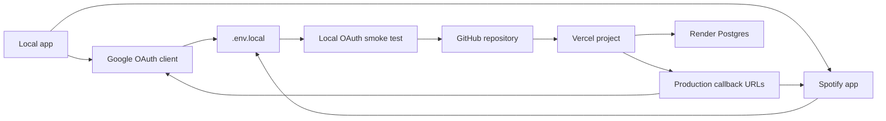

# OAuth, GitHub, and Vercel Deployment Runbook

This runbook takes the app from local OAuth testing to a GitHub-backed Vercel deployment.

The short version:



## Current Hosting Reality

The app uses Postgres through the `pg` driver. That is the correct shape for Vercel serverless because user data lives outside the function filesystem.

Use the external Render Postgres URL for local development and Vercel:

```text
DATABASE_URL=postgresql://...
DATABASE_SSL=true
```

Do not use the internal Render hostname from Vercel. Render internal database URLs are only reachable from Render services in the same private network.

## Local OAuth Values

Use these while developing locally:

```text
APP_URL=http://127.0.0.1:3000
DATABASE_URL=postgresql://...
DATABASE_SSL=true
DATABASE_CONNECT_TIMEOUT_MS=8000
DATABASE_POOL_MAX=3
GOOGLE_REDIRECT_URI=http://127.0.0.1:3000/api/auth/google/callback
SPOTIFY_REDIRECT_URI=http://127.0.0.1:3000/api/auth/spotify/callback
```

Create a local env file:

```bash
cp .env.example .env.local
```

Generate a strong session secret:

```bash
node -e "console.log(crypto.randomBytes(32).toString('hex'))"
```

Put that value in:

```text
SESSION_SECRET=your-generated-value
```

## Google OAuth Credentials

1. Open [Google Cloud Console](https://console.cloud.google.com/).
2. Create a new project, or select an existing project for this app.
3. Go to **APIs & Services -> Library**.
4. Search for **YouTube Data API v3** and click **Enable**.
5. Go to **APIs & Services -> OAuth consent screen**.
6. Choose the app audience.
7. Add app name, user support email, developer contact email, and save.
8. Add the YouTube read-only scope:

```text
https://www.googleapis.com/auth/youtube.readonly
```

9. While in testing mode, add your Google account under **Test users**.
10. Go to **APIs & Services -> Credentials**.
11. Click **Create credentials -> OAuth client ID**.
12. Choose **Web application**.
13. Name it:

```text
YouTube Music Likes to Spotify Local
```

14. Add this authorized redirect URI:

```text
http://127.0.0.1:3000/api/auth/google/callback
```

15. Create the client.
16. Copy the client ID and client secret into `.env.local`:

```text
GOOGLE_CLIENT_ID=...
GOOGLE_CLIENT_SECRET=...
GOOGLE_REDIRECT_URI=http://127.0.0.1:3000/api/auth/google/callback
```

Google notes that web-server OAuth clients need enabled APIs, OAuth credentials, and exact redirect endpoints where the OAuth server can return the user after consent.

## Spotify OAuth Credentials

1. Open the [Spotify Developer Dashboard](https://developer.spotify.com/dashboard).
2. Click **Create app**.
3. Name it:

```text
YouTube Music Likes to Spotify
```

4. Add a short description:

```text
Migrates a user's YouTube Music liked songs into a Spotify playlist after review.
```

5. Add these local redirect URIs:

```text
http://127.0.0.1:3000/api/auth/spotify/callback
```

6. Select **Web API**.
7. Create the app.
8. Open the app settings and copy the client ID and client secret into `.env.local`:

```text
SPOTIFY_CLIENT_ID=...
SPOTIFY_CLIENT_SECRET=...
SPOTIFY_REDIRECT_URI=http://127.0.0.1:3000/api/auth/spotify/callback
```

The app requests these Spotify scopes:

```text
playlist-modify-private playlist-modify-public user-read-private
```

Spotify requires the redirect URI in the authorization request to exactly match a URI configured in the app dashboard. `localhost` is not allowed for Spotify redirects; use the explicit loopback IP literal `http://127.0.0.1:3000/api/auth/spotify/callback`.

## Local OAuth Smoke Test

Install and run:

```bash
npm install
npm run dev
```

Open:

```text
http://127.0.0.1:3000
```

Test in this order:

1. Click **Google**.
2. Consent with the test Google account.
3. Confirm the app returns to localhost and shows Google connected.
4. Click **Spotify**.
5. Consent with the Spotify account.
6. Confirm the app returns to localhost and shows Spotify connected.
7. Click **Fetch**.
8. Click **Match**.
9. Review accepted matches.
10. Click **Import**.
11. Check Spotify for the playlist named `Imported YouTube Likes`.

If Google says `redirect_uri_mismatch`, copy the exact `GOOGLE_REDIRECT_URI` from `.env.local` into the Google OAuth client.

If Spotify says invalid redirect URI, copy the exact `SPOTIFY_REDIRECT_URI` from `.env.local` into the Spotify dashboard.

## GitHub Repository Push

This machine does not currently have the GitHub CLI installed, so the clean path is standard Git over HTTPS or SSH.

1. Create a new empty repository on GitHub.
2. Do not initialize it with a README, license, or `.gitignore`.
3. From this project folder, run:

```bash
git init
git add .
git commit -m "Initial YouTube Music to Spotify migrator"
git branch -M main
git remote add origin https://github.com/YOUR_USERNAME/YOUR_REPO.git
git push -u origin main
```

If you use SSH instead:

```bash
git remote add origin git@github.com:YOUR_USERNAME/YOUR_REPO.git
git push -u origin main
```

GitHub's command-line import docs recommend creating the remote repository first, then adding the remote and pushing your committed local code.

## Vercel Serverless Deployment

Pick one canonical production app URL. The app redirects every other production host to `APP_URL`, so do not mix `syncifyx.vercel.app` and a custom domain between `APP_URL`, Google redirect URLs, and Spotify redirect URLs.

Current canonical production app URL:

```text
https://syncifyx.vercel.app
```

1. Open [Vercel](https://vercel.com/).
2. Click **Add New -> Project**.
3. Import the GitHub repository.
4. Keep the framework preset as **Next.js**.
5. Add environment variables for **Production**, **Preview**, and **Development** as needed:

```text
APP_URL=https://YOUR_VERCEL_PROJECT.vercel.app
SESSION_SECRET=the-same-kind-of-strong-random-value
DATABASE_URL=postgresql://YOUR_EXTERNAL_RENDER_POSTGRES_URL
DATABASE_SSL=true
DATABASE_CONNECT_TIMEOUT_MS=8000
DATABASE_POOL_MAX=3
GOOGLE_CLIENT_ID=...
GOOGLE_CLIENT_SECRET=...
GOOGLE_REDIRECT_URI=https://YOUR_VERCEL_PROJECT.vercel.app/api/auth/google/callback
YOUTUBE_API_KEY=...
YOUTUBE_MUSIC_LIKES_PLAYLIST_ID=LM
YOUTUBE_FALLBACK_TO_REGULAR_LIKES=false
OPENAI_API_KEY=
OPENAI_MATCHING_ENABLED=false
OPENAI_MODEL=gpt-5.4-mini
SPOTIFY_CLIENT_ID=...
SPOTIFY_CLIENT_SECRET=...
SPOTIFY_REDIRECT_URI=https://YOUR_VERCEL_PROJECT.vercel.app/api/auth/spotify/callback
```

For this project, the concrete production values are:

```text
APP_URL=https://syncifyx.vercel.app
GOOGLE_REDIRECT_URI=https://syncifyx.vercel.app/api/auth/google/callback
SPOTIFY_REDIRECT_URI=https://syncifyx.vercel.app/api/auth/spotify/callback
```

6. Deploy.
7. Copy the production deployment URL.
8. Return to Google Cloud Console and add:

```text
https://syncifyx.vercel.app/api/auth/google/callback
```

9. Return to Spotify Developer Dashboard and add:

```text
https://syncifyx.vercel.app/api/auth/spotify/callback
```

10. Redeploy if you changed Vercel environment variables.

Vercel environment variables are configured outside source code and are available during builds and function execution. Vercel for GitHub automatically deploys pushes and pull requests from GitHub.

If you switch to a custom domain such as `https://syncifyx.mellozone.site`, update all three production values together:

```text
APP_URL=https://syncifyx.mellozone.site
GOOGLE_REDIRECT_URI=https://syncifyx.mellozone.site/api/auth/google/callback
SPOTIFY_REDIRECT_URI=https://syncifyx.mellozone.site/api/auth/spotify/callback
```

Then add the matching Google and Spotify callback URLs in their developer dashboards. Leaving `APP_URL` on one host while OAuth callbacks point to another host can cause session cookies and connection status to appear to bounce between domains.

## Database Notes

The app creates these tables automatically on first database use:

```text
users
oauth_tokens
youtube_items
spotify_matches
imports
```

The first request to `/api/connections`, OAuth callback routes, or any import route will initialize the schema if it does not already exist.

## YouTube Music Liked Music Source

The app tries the YouTube Music `Liked Music` auto playlist first:

```text
YOUTUBE_MUSIC_LIKES_PLAYLIST_ID=LM
```

If the authenticated account/API combination cannot access `LM` through the YouTube Data API, the fetch will report the YouTube API error instead of silently importing the smaller regular YouTube liked-videos playlist.

To intentionally allow fallback to the smaller regular YouTube liked-videos playlist, set:

```text
YOUTUBE_FALLBACK_TO_REGULAR_LIKES=true
```

## Matching Controls

The review screen now supports:

- Batch matching with presets, custom values up to 500, or all-mode.
- Per-row **Find best match** for a single song.
- Sorting by review priority, best confidence score, accepted rows, or original YouTube order.
- Safer refresh behavior: fetching the YouTube Music source replaces old source rows so a previous regular YouTube-like import does not linger.
- Theme presets plus About/Customization/Migration mode panels for a more polished public page.
- Primary actions live in the top control bar; theme, batch, sort, and AI settings live in the customization drawer.

Deterministic matching remains the default. It searches multiple Spotify query shapes per song, then scores title, artist, duration, music signals, exact-title hits, exact-artist containment, and variant mismatches.

Optional OpenAI parse assist can be enabled with:

```text
OPENAI_API_KEY=...
OPENAI_MATCHING_ENABLED=true
OPENAI_MODEL=gpt-5.4-mini
```

When enabled, OpenAI only improves the artist/title guess before Spotify search. Spotify search and confidence scoring still happen inside the app.

## Motion and UX Notes

The UI uses small, purposeful motion:

- Sidebar slides in once on first paint.
- Main panels rise in with a short delay.
- Step items fade upward in sequence.
- Primary controls lift slightly on hover.
- The brand mark pulses gently to make the import flow feel alive.
- `prefers-reduced-motion` is respected, so users who disable motion are not forced through animations.

These animations should remain quiet. The product is a utility, so motion should confirm progress and orientation rather than feel like a landing-page showpiece.

## Production Checklist

- Google OAuth works locally.
- Spotify OAuth works locally.
- Fetch returns YouTube liked music items.
- Matching creates review rows.
- Import creates a Spotify playlist.
- Code is committed to `main`.
- GitHub remote exists.
- Vercel project imports the GitHub repo.
- Vercel env vars are set.
- Production callback URLs are added to Google and Spotify.
- External Render Postgres URL is used for Vercel.
- Render internal Postgres URL is not used on Vercel.
- Secrets are rotated after setup validation.

## Official References

- [Google OAuth for web server apps](https://developers.google.com/identity/protocols/oauth2/web-server)
- [Spotify redirect URI rules](https://developer.spotify.com/documentation/web-api/concepts/redirect_uri)
- [Spotify authorization code flow](https://developer.spotify.com/documentation/web-api/tutorials/code-flow)
- [Spotify scopes](https://developer.spotify.com/documentation/web-api/concepts/scopes)
- [GitHub: add locally hosted code](https://docs.github.com/en/migrations/importing-source-code/using-the-command-line-to-import-source-code/adding-locally-hosted-code-to-github)
- [Vercel for GitHub](https://vercel.com/docs/git/vercel-for-github)
- [Vercel environment variables](https://vercel.com/docs/environment-variables)
- [Vercel Postgres-compatible storage](https://vercel.com/docs/marketplace-storage)
